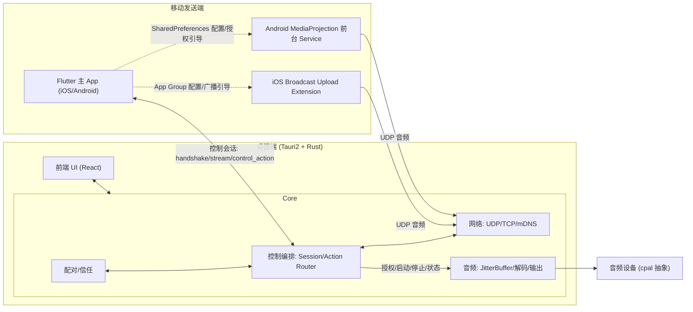
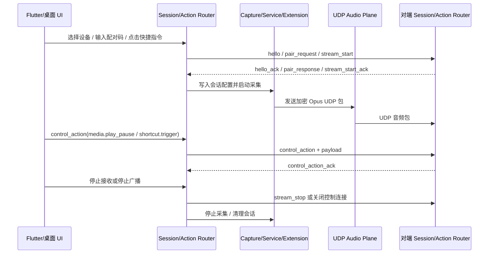

# 02 · 系统架构（Architecture）

## 1. 总体架构

## 2. 端侧角色

### 2.1 移动主 App（Flutter）
- **Flutter 主 App（Dart）**：iOS/Android 共用设备发现、配对码输入、信任管理、采集/广播引导、状态展示。
- **发现与控制**：发现使用 Dart `multicast_dns` 查询 `_soundlink._udp.local.`；控制通道使用 TCP + 换行分帧 JSON。
- **信任存储**：第一版移动端使用 `shared_preferences` 持久化已信任接收端公钥与元数据；后续再升级 Keychain / Keystore。

### 2.2 iOS 采集端
- **Broadcast Upload Extension（Swift）**：ReplayKit 接收 `CMSampleBuffer` → PCM 归一化 → Opus 编码 → 加密 → UDP 发送。
- 主 App 与 Extension 通过 **App Group** 共享会话配置；音频数据不回传 Flutter 主 App。

### 2.3 Android 采集端
- **前台 Service（Kotlin + MediaProjection + AudioPlaybackCapture）**：采集 App 播放音频 → PCM → Opus(JNI/libopus) → 加密 → UDP 发送。
- 主 App 通过 MethodChannel 写入 SharedPreferences 配置，并引导用户完成 MediaProjection 授权；Service 负责前台通知与采集生命周期。

### 2.4 桌面端（Tauri 2 + Rust）
- **Receiver 模式（第一版必做）**：mDNS 广播自身 → 显示配对码 → UDP 接收 → 解密/重排/JitterBuffer/解码/时钟校正 → 通过 `cpal` 输出到选定音频设备。
- **Sender 模式（阶段 5）**：Windows WASAPI Loopback 已实现；macOS ScreenCaptureKit 仍为占位待实现。采集后 Opus → UDP 发送，实现**双电脑互传**。

## 3. 模块划分（逻辑）

| 模块 | 职责 | 主要落地端 |
|---|---|---|
| Discovery | mDNS/Bonjour 发现与广播 | 全端 |
| Pairing | 配对码、密钥协商、信任存储 | 全端 |
| Session/Action Router | 同一控制会话下编排音频流生命周期、连接事件、通用控制动作与回执 | Flutter 主 App + 桌面 Rust Core |
| Capture | 系统音频采集 | 移动端 + 桌面 Sender |
| Codec | Opus 编解码 | 全端 |
| Transport | UDP 音频 + TCP JSON Lines 控制 + 加密 | 全端 |
| JitterBuffer | 抖动缓冲、重排、丢包处理 | 接收端 |
| Output | 音频设备输出 | 桌面端 |
| Clock | 时钟漂移校正 / 重采样 | 接收端 |
| Telemetry | 延迟/丢包/网络质量统计 | 全端 |

## 4. 控制面 / 数据面分离

- **控制面（Control Plane）**：当前实现为 TCP + UTF-8 JSON Lines（每条消息以 `\n` 结尾）；承载配对握手、能力协商、开始/停止流、心跳、统计上报、通用控制动作（`control_action`）与回执（`control_action_ack`）。WebSocket 仅作为后续可选扩展。
- **数据面（Data Plane）**：UDP 单播。承载 Opus 音频包，低延迟、可丢弃过期包。
- **统一受控原则**：控制面是唯一的会话编排入口。音频流生命周期（`stream_start` / `stream_stop`）、连接事件（EOF / heartbeat timeout / error）、媒体控制（上一曲、播放/暂停、下一曲）与快捷指令设置/触发都必须归属于同一个已配对控制会话；UDP 音频包只在该会话授权并启动后发送和接收。

### 4.1 同一控制会话下的互通框架

### 4.2 职责边界

- **Session/Action Router**：维护已配对会话、当前 `stream_id`、控制连接状态、心跳超时、动作路由和回执关联；所有会影响音频流或对端状态的操作都先进入该层。
- **音频流生命周期**：使用 `stream_start` / `stream_start_ack` / `stream_stop`；它们只表达流的开始、确认和停止，不承载媒体键或快捷指令语义。
- **通用控制动作**：使用 `control_action` / `control_action_ack`；`action` 使用点分命名，例如 `media.play_pause`、`media.previous`、`media.next`、`shortcut.set`、`shortcut.trigger`，参数统一放入 `payload`。
- **移动原生采集组件**：iOS Broadcast Extension 与 Android 前台 Service 不直接参与完整控制握手；它们由 Flutter 主 App 通过 App Group / SharedPreferences 下发会话配置和停止信号，仍受同一控制会话约束。
- **桌面双角色**：桌面 Receiver 与 Sender 都应复用相同控制会话模型；差异只在音频端是 UDP 接收输出还是采集发送。

详见 [04-protocol](./04-protocol.md)。

## 5. 关键设计取舍

- **不用 TCP 传音频主链路**：避免重传导致延迟堆积；音频宁可丢弃过期包。
- **第一版不集成 WebRTC**：对纯局域网偏重，且 iOS Extension 内集成复杂；采用轻量自研 Opus+UDP。
- **Rust Core 复用**：网络/协议/音频缓冲逻辑集中在 Rust，未来可考虑跨端复用。
