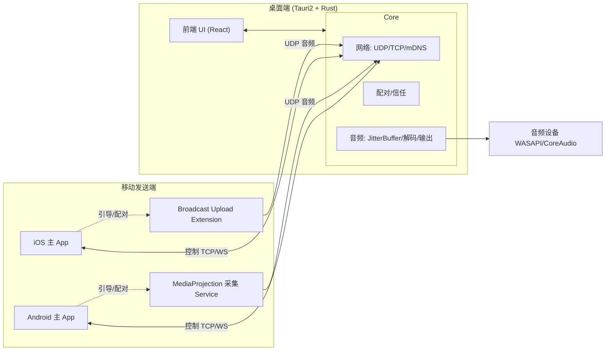

# 02 · 系统架构（Architecture）

## 1. 总体架构

## 2. 端侧角色

### 2.1 iOS 端
- **主 App（Swift/SwiftUI）**：设备发现、配对码输入、信任管理、引导开启屏幕广播、状态展示。
- **Broadcast Upload Extension**：ReplayKit 接收 `CMSampleBuffer` → PCM 归一化 → Opus 编码 → 加密 → UDP 发送。
- 主 App 与 Extension 通过 **App Group** 共享配对/密钥信息。

### 2.2 Android 端
- **主 App（Kotlin/Compose）**：设备发现、配对、信任管理、请求 MediaProjection 授权、状态展示。
- **前台 Service（MediaProjection + AudioPlaybackCapture）**：采集 App 播放音频 → PCM → Opus → 加密 → UDP 发送。
- 通过 EncryptedSharedPreferences / Keystore 存储信任信息。

### 2.3 桌面端（Tauri 2 + Rust）
- **Receiver 模式（第一版必做）**：mDNS 广播自身 → 显示配对码 → UDP 接收 → 解密/重排/JitterBuffer/解码/时钟校正 → 输出到选定音频设备。
- **Sender 模式（后续）**：WASAPI Loopback（Windows）/ ScreenCaptureKit（macOS）采集系统音频 → Opus → UDP 发送，实现**双电脑互传**。

## 3. 模块划分（逻辑）

| 模块 | 职责 | 主要落地端 |
|---|---|---|
| Discovery | mDNS/Bonjour 发现与广播 | 全端 |
| Pairing | 配对码、密钥协商、信任存储 | 全端 |
| Capture | 系统音频采集 | 移动端 + 桌面 Sender |
| Codec | Opus 编解码 | 全端 |
| Transport | UDP 音频 + TCP/WS 控制 + 加密 | 全端 |
| JitterBuffer | 抖动缓冲、重排、丢包处理 | 接收端 |
| Output | 音频设备输出 | 桌面端 |
| Clock | 时钟漂移校正 / 重采样 | 接收端 |
| Telemetry | 延迟/丢包/网络质量统计 | 全端 |

## 4. 控制面 / 数据面分离

- **控制面（Control Plane）**：TCP / WebSocket。承载配对握手、能力协商、开始/停止流、心跳、统计上报。可靠、低频。
- **数据面（Data Plane）**：UDP 单播。承载 Opus 音频包，低延迟、可丢弃过期包。

详见 [04-protocol](./04-protocol.md)。

## 5. 关键设计取舍

- **不用 TCP 传音频主链路**：避免重传导致延迟堆积；音频宁可丢弃过期包。
- **第一版不集成 WebRTC**：对纯局域网偏重，且 iOS Extension 内集成复杂；采用轻量自研 Opus+UDP。
- **Rust Core 复用**：网络/协议/音频缓冲逻辑集中在 Rust，未来可考虑跨端复用。
