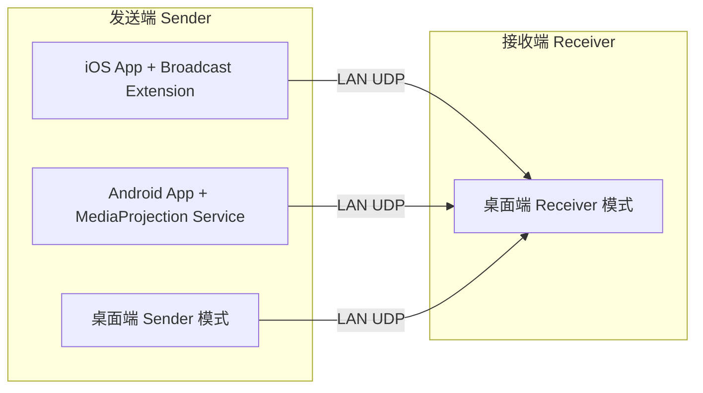

# SoundLink 项目结构总览（Structure Overview）

> 本文件是 SoundLink 的**顶层导航与结构说明**，经过精简重构，只保留“是什么 / 大致怎么分层 / 去哪看细节”。
> 详细的架构、技术路线、协议、里程碑等内容已拆分到 `docs/First/` 下的专题文档，见文末索引。

---

## 1. 一句话定义

SoundLink 是一套面向**头戴式耳机用户**的**局域网音频流转软件**：

> 把手机（iOS / Android）正在播放的音频，通过局域网低延迟传输到电脑，由电脑输出到耳机、声卡、音箱等音频设备；同时支持**电脑到电脑**互传。

---

## 2. 核心需求映射

| 需求 | 落地方式 | 详见 |
|---|---|---|
| 手机端客户端（iOS + Android） | iOS ReplayKit / Android MediaProjection 采集 App 音频 | [02-architecture](./02-architecture.md) |
| 手机端“模拟音频输出，流转全部音频” | 系统级屏幕/媒体广播采集（合规边界内，非全局虚拟声卡） | [08-platform-notes](./08-platform-notes.md) |
| 电脑端客户端 | Tauri 2 + Rust，接收 → 解码 → 输出到音频设备 | [02-architecture](./02-architecture.md) |
| 局域网传输 | 控制通道 TCP/WS + 音频通道 UDP（RTP-like） | [04-protocol](./04-protocol.md) |
| 快速配对（配对码） | mDNS 发现 + 配对码 + 密钥协商 + 本地信任 | [05-pairing-security](./05-pairing-security.md) |
| 双电脑互传 | 桌面端可切换为 Sender（WASAPI Loopback / ScreenCaptureKit） | [02-architecture](./02-architecture.md) |
| 延迟与体验评估 | 分环节延迟预估 + 场景可用性结论 | [06-latency-experience](./06-latency-experience.md) |

---

## 3. 端侧角色



- **发送端（Sender）**：采集音频 → Opus 编码 → 打包加密 → UDP 发送。
- **接收端（Receiver）**：UDP 接收 → 解密重排 → Jitter Buffer → Opus 解码 → 时钟校正 → 音频输出。
- **桌面端**同时具备 Receiver（第一版必做）与 Sender（后续）两种角色。

---

## 4. 端到端音频链路（简版）

```text
[采集] 手机系统广播 / 桌面 Loopback
   → PCM 归一化 (48kHz Stereo)
   → Opus 编码
   → Packetize + Encrypt
   → LAN UDP 单播
=======================================
   → UDP 接收 → Decrypt → 重排
   → Jitter Buffer
   → Opus 解码
   → Resample / 时钟漂移校正
   → [输出] WASAPI / CoreAudio / PipeWire
```

细节见 [03-audio-pipeline](./03-audio-pipeline.md)。

---

## 5. 技术选型速览

| 层 | iOS | Android | 桌面端 |
|---|---|---|---|
| 语言 | 主 App：Dart(Flutter)；采集：Swift | 主 App：Dart(Flutter)；采集：Kotlin | Rust + 前端 TS |
| UI | Flutter（主 App） | Flutter（主 App） | Tauri 2 + React |
| 采集 | ReplayKit Broadcast Extension（原生 Swift） | MediaProjection + AudioPlaybackCapture（原生 Kotlin） | WASAPI Loopback（已实现）/ ScreenCaptureKit（占位） |
| 编解码 | libopus | libopus（JNI/CMake） | libopus_sys FFI（`opus` feature） |
| 网络 | UDP(采集) + Dart TCP JSON Lines(控制) | UDP(采集) + Dart TCP JSON Lines(控制) | tokio UDP + TCP JSON Lines |
| 发现 | Dart multicast_dns | Dart multicast_dns | mdns-sd |
| 加密 | ChaCha20-Poly1305 | ChaCha20-Poly1305 | ChaCha20-Poly1305 |
| 密钥/信任 | shared_preferences（后续 Keychain） | shared_preferences（后续 Keystore） | 本地 JSON trust store |

完整选型见 [07-tech-stack](./07-tech-stack.md)。

---

## 6. 延迟与体验结论（速览）

| 链路 | 预估总延迟 | 适用场景 |
|---|---:|---|
| iOS → 桌面 | ~140–370 ms | 音乐 / 电影 / 长视频较好；短视频可能感知音画不同步 |
| Android → 桌面 | ~120–320 ms | 与 iOS 接近，采集环节略灵活 |
| 桌面 → 桌面 | ~30–120 ms | 视频、电影、音乐良好，轻度游戏可接受 |

> 结论：适合**听音乐、看电影、长视频**；**短视频/游戏/连麦不作为第一版主打**。电脑端建议使用**有线 / USB / 2.4G 低延迟耳机**。详见 [06-latency-experience](./06-latency-experience.md)。

---

## 7. 第一版范围（MVP）

- iOS：发现 + 配对 + 引导广播 + ReplayKit 采集 + Opus + UDP 发送。
- Android：发现 + 配对 + MediaProjection 采集 + Opus + UDP 发送。
- 桌面（Windows + macOS）：Receiver 模式（发现广播 / 配对码 / 接收解码 / 设备输出 / 状态展示）。
- **暂不做**：全局虚拟声卡、AirPlay 兼容、后台静默捕获、多接收端同步、游戏低延迟模式、Linux。

阶段划分见 [09-roadmap](./09-roadmap.md)。

---

## 8. 文档索引

| 文档 | 内容 |
|---|---|
| [01-overview](./01-overview.md) | 产品背景、目标用户、价值主张、非目标 |
| [02-architecture](./02-architecture.md) | 系统架构、端侧角色、模块划分、数据流 |
| [03-audio-pipeline](./03-audio-pipeline.md) | 音频采集/编码/传输/解码/输出全链路细节 |
| [04-protocol](./04-protocol.md) | 控制协议 + 音频包格式 + 传输策略 |
| [05-pairing-security](./05-pairing-security.md) | 配对流程、配对码、密钥协商、信任存储 |
| [06-latency-experience](./06-latency-experience.md) | 延迟拆解、体验评估、优化方向 |
| [07-tech-stack](./07-tech-stack.md) | 全端技术选型与理由 |
| [08-platform-notes](./08-platform-notes.md) | iOS/Android/Windows/macOS 平台能力与合规边界 |
| [09-roadmap](./09-roadmap.md) | 开发阶段与里程碑 |
| [10-project-structure](./10-project-structure.md) | 代码仓库目录结构说明 |
| [11-implementation-spec](./11-implementation-spec.md) | **实现规格书**：字节布局/消息schema/错误码/握手/状态机/常量/脚手架/自测 |
| [12-plan](./12-plan.md) | **开发计划与进度表**：总计划 + 各阶段进度（完成后回填） |

工程结构与目录约定见 [10-project-structure](./10-project-structure.md)；
仓库根目录的 `AGENTS.md` 与 `.trae/rules/project-rules.md` 为 TRAE / AI 协作规则。
