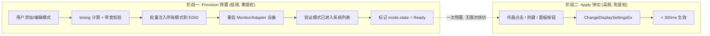
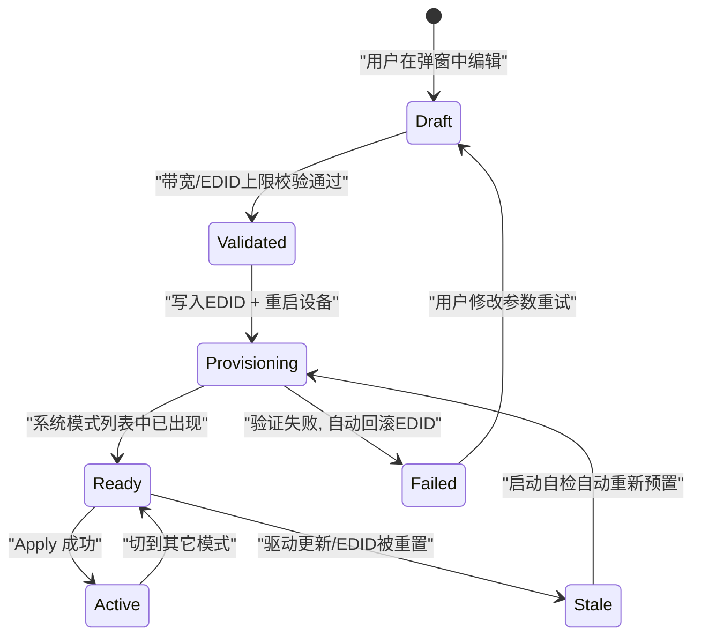
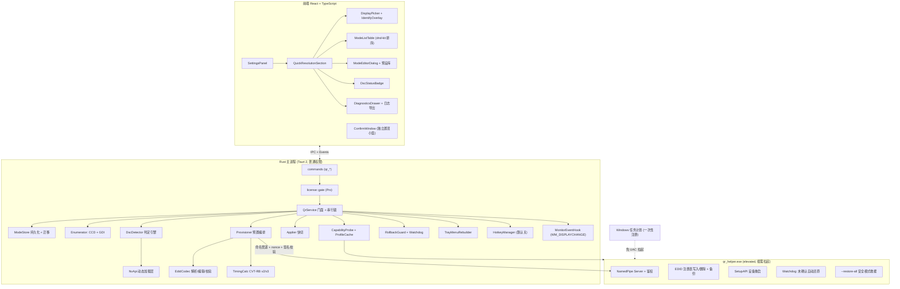
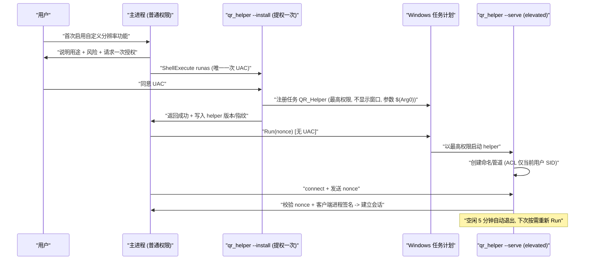
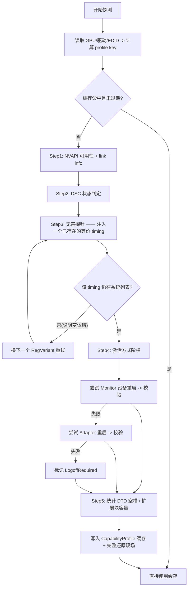
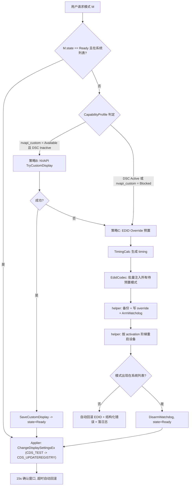
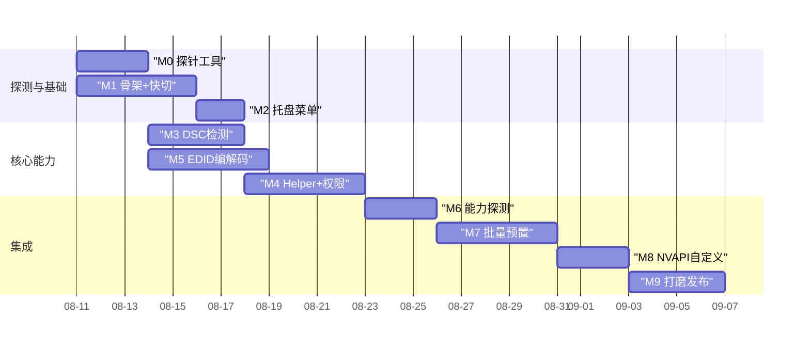

---

# 一、需求边界（已锁定）

| 项 | 结论 |
|---|---|
| GPU 范围 | **仅 NVIDIA**（架构保留 `DisplayBackend` trait，未来可插 AMD/Intel，本期不实现） |
| DSC 场景 | **EDID Override + 驱动重启为正式方案**，支持一键切换 |
| 提权 | 首次 UAC 授权，之后静默；helper 独立进程 |
| 机型适配 | 运行时自适应探测，不维护机型清单 |
| 刷新率 | 整数 Hz，只针对显示器实际支持范围 |
| 多显示器 | 支持，设置内提供**显示器编号 + 识别叠层** |
| HDR/VRR | **不主动改动**，仅在切换后校验其状态是否被系统重置并提示 |
| 全局热键 | 实现但**默认关闭** |
| 遥测 | **无上报**，全部落本地日志 + 可导出诊断包 |

---

# 二、核心架构：两阶段模型（本方案的关键）

这是让"DSC + 自定义分辨率 + 一键切换"同时成立的核心思路。



**这解决了什么**
- 用户新增 `1920x1440 480Hz` 时，付一次"提权 + 3 秒黑屏"的代价；
- 之后每次切换就是普通分辨率切换，和切换系统自带模式毫无区别；
- 托盘二级菜单点一下就换，符合你"快捷切换"的原始诉求。

**模式生命周期状态机**



`Stale` 状态很重要：NVIDIA 驱动更新会清掉 EDID Override。应用启动时自检，发现 `Ready` 模式已不在系统列表 → 自动静默重新预置（因为 helper 已免 UAC）。

---

# 三、整体模块架构



---

# 四、权限模型：一次授权，之后静默

## 4.1 方案：一次性 UAC → 注册计划任务 → 后续静默拉起



**为什么用任务计划而不是 Windows 服务**
- 服务需要安装/卸载生命周期管理、开机常驻、更易被杀软标记；
- 计划任务只在需要时拉起、用完即走、卸载时一条命令清理；
- 完全满足"首次申请、后续免申请"。

## 4.2 安全加固（elevated 进程必须做）

| 措施 | 说明 |
|---|---|
| 管道 ACL | `\\.\pipe\<AppId>.qrhelper`，DACL 仅授予创建者 SID + SYSTEM，拒绝 Everyone |
| Nonce 握手 | 主进程生成 32 字节随机数，经计划任务 `$(Arg0)` 传入；不匹配立即断开 |
| 客户端校验 | `GetNamedPipeClientProcessId` → 取映像路径 → **Authenticode 签名 + 发布者校验**，非本应用直接拒绝 |
| 命令白名单 | helper 只接受 7 个固定指令，**不接受任意注册表路径/任意命令行**，路径由 helper 自己根据 monitor instance 推导 |
| 版本绑定 | helper 与主程序版本不一致 → 拒绝服务，触发重新 `--install`（会再弹一次 UAC，属预期） |
| 幂等 + 审计 | 每条写操作前落 `helper.log`（独立文件），含操作前后 EDID 哈希 |
| 空闲退出 | 5 分钟无请求自动退出，缩小攻击面 |

## 4.3 Helper 协议

```rust
// crates/qr-ipc/src/lib.rs —— 主进程与 helper 共享
#[derive(Serialize, Deserialize, Debug)]
pub enum HelperRequest {
    Handshake { nonce: [u8; 32], client_version: String },
    ReadEdid { monitor: MonitorKey },
    WriteEdidOverride { monitor: MonitorKey, edid: Vec<u8>, backup_id: String },
    RemoveEdidOverride { monitor: MonitorKey },
    RestartDevice { target: RestartTarget },      // Monitor | Adapter
    ArmWatchdog { seconds: u32, backup_id: String },
    DisarmWatchdog,
    Probe { plan: ProbePlan },                    // 自适应探测
}

#[derive(Serialize, Deserialize, Debug)]
pub enum HelperResponse {
    Ok,
    Edid(Vec<u8>),
    Written { variant: RegVariant, backup_path: String },
    Restarted { method: ActivationMethod, elapsed_ms: u64 },
    ProbeResult(CapabilityProfile),
    Err { code: HelperErrCode, msg: String },
}
```

---

# 五、自适应能力探测（替代机型清单）

你的第 4 点是这套方案里最需要工程智慧的地方。做法：**不认机型，只认能力；探一次，缓存起来。**

## 5.1 能力档案（Capability Profile）

```rust
pub struct CapabilityProfile {
    /// 缓存键: GPU PCI ID + 驱动版本 + 显示器 EDID SHA256 + 连接器类型
    pub key: String,

    /// NVAPI 自定义分辨率是否可用 (DSC 开启后通常为 Blocked)
    pub nvapi_custom: TriState,
    pub nvapi_custom_last_status: Option<i32>,   // 原始返回码, 存日志用

    /// EDID Override 生效的注册表变体 (探测得出, 不硬编码)
    pub edid_reg_variant: Option<RegVariant>,

    /// 让 override 生效的最小代价激活方式
    pub activation: Option<ActivationMethod>,    // MonitorRestart < AdapterRestart < LogoffRequired

    /// EDID 可扩展容量
    pub max_extension_blocks: Option<u8>,
    pub free_dtd_slots: Option<u8>,
    pub displayid_supported: Option<bool>,

    /// 该链路实测可达上限 (用于 UI 预警)
    pub verified_max_pixel_clock_khz: Option<u32>,

    pub probed_at: i64,
    pub probe_log_id: String,
}

pub enum RegVariant {
    MonitorInstanceOverride,        // Enum\DISPLAY\<id>\<inst>\Device Parameters\EDID_OVERRIDE
    ClassMonitorOverride,           // Control\Class\{monitor GUID}\NNNN
    GraphicsDriversConfiguration,   // Control\GraphicsDrivers\Configuration\...
}
```

## 5.2 探测阶梯（Probe Ladder）

首次启用功能时跑一次，之后仅在"GPU/驱动/显示器任一变化"时重跑。



**Step3 的巧思**：探针注入的是**显示器本来就支持的一个 timing 的等价副本**（例如把 native 模式复制到一个空 DTD 槽）。这样即使写错位置也不会导致黑屏，却能验证"注册表变体是否被驱动读取"。探测全程结束后完整还原原始 EDID。

**探测失败的降级**：任何一步失败 → `nvapi_custom` 与 `edid_reg_variant` 均不可用 → 前端把"添加自定义模式"置灰，但**保留"从系统导入已有模式 + 快切"能力**，功能不至于完全不可用。

---

# 六、DSC 检测引擎

## 6.1 三路交叉判定

**① 带宽推算（主判据）**

像素时钟：

$$
f_{pixel} = H_{total} \times V_{total} \times f_{refresh}
$$

未压缩所需净带宽：

$$
B_{req} = f_{pixel} \times bpp_{eff},\quad
bpp_{eff} =
\begin{cases}
3 \times bpc & \text{RGB / YCbCr444}\\
2 \times bpc & \text{YCbCr422}\\
1.5 \times bpc & \text{YCbCr420}
\end{cases}
$$

DP 链路可用净带宽：

$$
B_{avail} =
\begin{cases}
N_{lane} \times R_{lane} \times \dfrac{8}{10} & \text{HBR / HBR2 / HBR3 (8b/10b)}\\[8pt]
N_{lane} \times R_{lane} \times \dfrac{128}{132} \times \eta_{FEC} & \text{UHBR (128b/132b)}
\end{cases}
$$

HDMI 2.1 FRL 同理：$B_{avail} = N_{lane} \times R_{FRL} \times \frac{16}{18}$。

判定规则：

$$
B_{req} > B_{avail} \times 0.98 \;\Longrightarrow\; \text{DSC 必然处于启用状态}
$$

DSC 启用时，校验目标模式可行性改用压缩带宽：

$$
B_{req}^{DSC} = f_{pixel} \times bpp_{target},\quad bpp_{target} \in [8, 12]
$$

以 `1920×1440@480Hz`（CVT-RB v3，估算 $H_{total}\approx2000$、$V_{total}\approx1471$）为例：

$$
f_{pixel} \approx 2000 \times 1471 \times 480 \approx 1.412\ \text{GPix/s}
$$

$$
B_{req}^{10bpc,RGB} \approx 1.412 \times 30 \approx 42.4\ \text{Gbps}
$$

DP 2.1 UHBR13.5 ×4 可用约 $4 \times 13.5 \times \frac{128}{132} \approx 52.4$ Gbps → 未压缩勉强可行；UHBR10 ×4（≈38.8 Gbps）则**必须 DSC**。这类计算结果全部展示在编辑弹窗里，让你在保存前就知道能不能成。

**② NVAPI 链路信息（辅助）**
- `NvAPI_GetDisplayPortInfo` → lane count / link rate / bpc / color format
- `NvAPI_DISP_GetTiming` → 当前实际 H/V total、pixel clock
- `NvAPI_DISP_GetEdid` → 原始 EDID

> **我必须明确的不确定点**：NVAPI 是否稳定暴露"DSC 当前是否 active / target bpp"的公开字段，随驱动版本而异。因此实现上采用 **feature probe**：能取到就用作强证据，取不到就完全依赖带宽推算。我不会假设某个具体字段一定存在。

**③ EDID / DisplayID 能力解析（补充）**
解析 CTA-861 与 DisplayID 2.0 中的 DSC 能力描述，得出"显示器是否支持 DSC"，用于提示"你的线材/端口可能是瓶颈"。注意：**支持 ≠ 当前启用**。

## 6.2 输出

```rust
pub enum DscState {
    Active,
    Inactive,
    LikelyActive { confidence: f32, basis: Vec<&'static str> },
    Unknown { reason: String },
    ForcedByUser(bool),
}
```

设置面板徽标示例：
`DSC 已启用 · DP2.1 UHBR13.5 ×4 · 10bpc RGB · 需 42.4/可用 52.4 Gbps` `[诊断]`

用户可在设置里手动覆盖为 `强制视为已启用 / 强制视为未启用`（对应 `dscOverride`），应对检测失灵。

---

# 七、切换策略路由



## 7.1 Applier（高频路径，必须快且稳）

```rust
pub fn apply(target: &ResolvedDisplay, m: &DisplayModeEntry) -> Result<(), QrError> {
    // 1) 精确匹配系统已注册模式, 避免 Windows 把 480 取整/回退到 60
    let matched = gdi::enum_modes(&target.gdi_name)?
        .into_iter()
        .find(|d| d.dmPelsWidth == m.width
               && d.dmPelsHeight == m.height
               && d.dmDisplayFrequency == m.refresh_hz as u32)
        .ok_or(QrError::ModeNotRegistered)?;

    let mut dm = matched;
    dm.dmFields = DM_PELSWIDTH | DM_PELSHEIGHT | DM_DISPLAYFREQUENCY | DM_BITSPERPEL;

    unsafe {
        let t = ChangeDisplaySettingsExW(pcwstr(&target.gdi_name), Some(&dm),
                                         HWND::default(), CDS_TEST, None);
        if t != DISP_CHANGE_SUCCESSFUL {
            return Err(QrError::Win32 { api: "CDS_TEST".into(), code: t.0 });
        }
        let r = ChangeDisplaySettingsExW(pcwstr(&target.gdi_name), Some(&dm),
                                         HWND::default(),
                                         CDS_UPDATEREGISTRY | CDS_GLOBAL, None);
        if r != DISP_CHANGE_SUCCESSFUL {
            return Err(QrError::Win32 { api: "CDS_APPLY".into(), code: r.0 });
        }
    }
    Ok(())
}
```

因为不需要小数刷新率，这条路径极简；**CCD 只用于枚举/标识/快照回滚**，避免 `SetDisplayConfig` 的拓扑副作用。

## 7.2 策略 B：NVAPI 自定义模式（DSC 未启用时优先，副作用最小）

调用序列：`NvAPI_Initialize` → 取 `displayId` → 构造 `NV_TIMING` → `TryCustomDisplay`（临时，弹确认）→ `SaveCustomDisplay` / `RevertCustomDisplay`。

FFI 采用 **`libloading` 动态加载 `nvapi64.dll` + `nvapi_QueryInterface(ordinal)`**，绝不静态链接：

```rust
pub struct NvApi { _lib: Library, query: unsafe extern "C" fn(u32) -> *mut c_void }

impl NvApi {
    pub fn load() -> Result<Self, QrError> {
        let lib = unsafe { Library::new("nvapi64.dll") }
            .map_err(|_| QrError::NvApiUnavailable)?;
        let query: Symbol<unsafe extern "C" fn(u32) -> *mut c_void> =
            unsafe { lib.get(b"nvapi_QueryInterface\0") }
                .map_err(|_| QrError::NvApiUnavailable)?;
        let query = *query;
        let me = Self { _lib: lib, query };
        me.initialize()?;                      // ordinal: NvAPI_Initialize
        Ok(me)
    }

    /// 每个函数独立 probe, 缺失即返回 None 而非 panic —— 保证跨驱动版本不崩
    unsafe fn fetch<T>(&self, ordinal: u32) -> Option<T> {
        let p = (self.query)(ordinal);
        if p.is_null() { None } else { Some(std::mem::transmute_copy(&p)) }
    }
}
```

## 7.3 策略 C：EDID Override 批量预置（DSC 场景主力）

**核心改进：批量。** 不是"每加一个分辨率重启一次驱动"，而是把用户全部 `Draft/Validated` 模式**一次性合并注入**，只重启一次。

```rust
pub async fn provision_batch(&self, monitor: &MonitorKey, pending: &[DisplayModeEntry])
    -> Result<ProvisionReport, QrError>
{
    let _lock = self.serial_lock.lock().await;          // 全局串行, 禁止并发预置

    // 0) 前置守卫
    guard::reject_if_fullscreen_exclusive()?;           // 游戏中禁止
    guard::reject_if_on_battery_critical()?;

    // 1) 读原始 EDID (NVAPI 优先, 注册表兜底)
    let original = self.read_edid(monitor).await?;
    let backup_id = self.backup_edid(monitor, &original)?;   // .bin + 一键还原 .reg

    // 2) 计算 timing 并合并进 EDID
    let mut edid = EdidDoc::parse(&original)?;
    let mut placed = vec![];
    for m in pending {
        let t = timing::generate(m, &self.profile)?;         // CVT-RB v3 / native-blanking
        bandwidth::validate(&t, &self.link_info, &self.dsc_state)?;
        match edid.insert_timing(&t) {
            Ok(slot) => placed.push((m.id.clone(), slot)),   // DTD 槽 或 DisplayID Type-VII
            Err(EdidErr::NoSlot) => {
                // 容量不足: 追加 DisplayID 2.0 扩展块, 仍不行则让用户选择替换项
                edid.append_displayid_block()?;
                placed.push((m.id.clone(), edid.insert_timing(&t)?));
            }
            Err(e) => return Err(e.into()),
        }
    }
    edid.fix_extension_count();
    edid.recompute_all_checksums();

    // 3) 提权写入 + 武装看门狗 (崩溃/黑屏也能自愈)
    let h = self.helper.session().await?;
    h.write_edid_override(monitor, edid.to_bytes(), &backup_id).await?;
    h.arm_watchdog(60, &backup_id).await?;               // 60s 内未 disarm -> helper 自动还原并重启设备

    // 4) 按能力档案的激活阶梯生效
    let act = self.activate_with_ladder(monitor, &h).await?;

    // 5) 验证闭环
    let modes = gdi::enum_modes(&monitor.gdi_name)?;
    let (ok, fail): (Vec<_>, Vec<_>) = pending.iter()
        .partition(|m| modes.iter().any(|d| d.matches(m)));

    if ok.is_empty() {
        h.remove_edid_override(monitor).await?;
        h.restart_device(RestartTarget::Monitor).await.ok();
        h.disarm_watchdog().await.ok();
        return Err(QrError::ProvisionVerifyFailed { attempted: pending.len() });
    }

    h.disarm_watchdog().await?;
    Ok(ProvisionReport {
        succeeded: ok.iter().map(|m| m.id.clone()).collect(),
        failed:    fail.iter().map(|m| m.id.clone()).collect(),
        activation: act,
        backup_id,
    })
}
```

**Timing 生成策略（`timing.rs`）**

| 模式 | 用途 |
|---|---|
`auto` | 优先 **native-blanking 继承**：沿用显示器原生模式的 blanking 结构，只改 active 与 refresh。对高刷显示器兼容性最好 |
`cvt-rb2` / `cvt-rb3` | 标准化减少消隐，480Hz 这类极限刷新的首选 |
`manual` | 高级用户直填 front porch / sync width / back porch / polarity |

## 7.4 黑屏保险（三层）

| 层 | 机制 |
|---|---|
| **L1 helper Watchdog** | 预置前 `ArmWatchdog(60s)`。主进程若因黑屏无法交互/崩溃 → helper 到点自动还原 EDID 并重启设备 |
| **L2 启动自检** | 应用启动读 `pending_recovery.json`，发现上次预置未收尾 → 立即回滚并弹出说明 |
| **L3 离线救援** | 备份目录内生成 `restore_<monitor>_<ts>.reg` 与 `qr_helper.exe --restore-all`，**可在安全模式下双击执行**；帮助文档给出图文步骤 |

另外，Apply 阶段沿用 **15 秒确认窗口**（独立 always-on-top 小窗，因为主窗在切换后可能错位或被最小化）：

```rust
pub async fn apply_with_guard(&self, req: SwitchRequest) -> Result<SwitchResult, QrError> {
    let snap = ccd::snapshot()?;                       // 完整拓扑快照
    let guard = RollbackGuard::new(snap.clone());       // Drop 时若未 commit 则回滚

    applier::apply(&req.target, &req.mode)?;

    if !self.settings.confirm_before_apply {
        guard.commit();
        return Ok(SwitchResult::Applied);
    }

    let (tx, rx) = oneshot::channel();
    self.pending.write().await.replace(tx);
    self.app.emit("qr://confirm-needed", ConfirmPayload {
        mode: req.mode.brief(), timeout_secs: self.settings.auto_revert_seconds,
    })?;

    match timeout(Duration::from_secs(self.settings.auto_revert_seconds as u64), rx).await {
        Ok(Ok(())) => { guard.commit(); Ok(SwitchResult::Applied) }
        _ => { drop(guard); Ok(SwitchResult::RevertedByTimeout) }   // guard 自动还原
    }
}
```

---

# 八、多显示器与"显示器编号"

## 8.1 三层标识体系

| 层 | 内容 | 用途 |
|---|---|---|
| 展示层 | **显示器编号 1/2/3**（与 Windows 显示设置中的编号一致，取自 CCD source id 排序）+ 厂商型号 | UI 与托盘展示："显示器 2 · LG 27GR95QE" |
| 稳定层 | `MonitorKey = sha256(EDID) + connector + device instance path` | 配置持久化的真实主键，重启/换口不丢 |
| 系统层 | `\\.\DISPLAY1` GDI 名 | 调 Win32 时使用，**每次运行都重新解析，绝不持久化** |

```rust
pub struct DisplayInfo {
    pub index: u32,                  // UI 编号 1..N
    pub key: MonitorKey,             // 稳定主键
    pub gdi_name: String,            // 运行时解析
    pub friendly_name: String,       // "LG ULTRAGEAR"
    pub is_primary: bool,
    pub current: Timing,
    pub link: DisplayLinkInfo,
    pub dsc: DscState,
}
```

`targetDisplay` 支持三种绑定：`Primary` / `Index(n)` / `Key(monitor_key)`。推荐默认 `Key`（最稳），UI 上以编号呈现。

## 8.2 识别叠层（Identify）

设置区提供 `[识别显示器]` 按钮：在每块屏幕上创建无边框、置顶、点击穿透的 Tauri 窗口，居中显示巨大数字 `1` `2` `3`，3 秒后自动消失。这是让用户搞清编号最直观的方式。

---

# 九、数据模型

```typescript
// src/features/quickResolution/types.ts
export type ModeState = 'draft' | 'validated' | 'provisioning' | 'ready' | 'active' | 'stale' | 'failed';
export type ProvisionPath = 'system' | 'nvapi' | 'edid';

export interface DisplayModeEntry {
  id: string;
  label: string;                     // "竞技 4:3"
  width: number;
  height: number;
  refreshHz: number;                 // 整数
  bitDepth?: 8 | 10 | 12;
  colorFormat?: 'RGB' | 'YCbCr444' | 'YCbCr422' | 'YCbCr420';
  scaling?: 'aspect' | 'fullscreen' | 'centered' | 'noscaling';
  target: { kind: 'primary' } | { kind: 'index'; index: number } | { kind: 'key'; key: string };
  timingStandard: 'auto' | 'cvt-rb2' | 'cvt-rb3' | 'manual';
  manualTiming?: ManualTiming;
  state: ModeState;
  provisionPath?: ProvisionPath;
  lastError?: { code: string; message: string; at: number };
  pinnedToTray: boolean;
  order: number;
  hotkey?: string | null;            // 默认 null
  createdAt: number;
  lastUsedAt?: number;
}

export interface QuickResolutionSettings {
  schemaVersion: 1;
  enabled: boolean;
  showInTray: boolean;
  maxTrayItems: number;              // 默认 8
  confirmBeforeApply: boolean;       // 默认 true
  autoRevertSeconds: number;         // 默认 15
  restoreOnAppExit: boolean;         // 默认 false
  dscOverride: 'auto' | 'force-on' | 'force-off';
  allowEdidOverride: boolean;        // 默认 false, 首次开启需风险二次确认
  enableGlobalHotkeys: boolean;      // 默认 false
  helperInstalled: boolean;
  modes: DisplayModeEntry[];
}
```

**持久化布局**

```
%APPDATA%/<App>/
├── quick_resolution.json          # 设置 + 模式列表 (schemaVersion 迁移)
├── capability_profiles.json       # 能力档案缓存 (按 profile key)
├── pending_recovery.json          # 崩溃恢复标记 (仅预置期间存在)
├── backups/edid/
│   ├── <monitorKey8>-20260808-1623.bin
│   └── restore_<monitorKey8>-20260808-1623.reg
└── logs/
    ├── app.log.2026-08-08          # tracing, 按天轮转, 保留 14 天
    └── helper.log.2026-08-08       # elevated 操作审计
```

---

# 十、前端 UI

## 10.1 设置面板 —— 快速分辨率切换区（启动区域下方）

```
┌─ 快速分辨率切换  [PRO]                                  [ ● 开启 ] ─┐
│                                                                     │
│  显示器: [ 1 · LG ULTRAGEAR (主) ▾ ]     [识别显示器]                │
│  当前:   3840×2160 @ 240Hz · 10bpc RGB                              │
│  链路:   ● DSC 已启用 · DP2.1 UHBR13.5 ×4 · 需 42.4 / 可用 52.4 Gbps │
│          自定义模式将通过 EDID 注入实现          [诊断详情]           │
│                                                                     │
│  ┌───────────────────────────────────────────────────────────────┐  │
│  │ ⠿ │ 名称        │ 分辨率     │ 刷新 │ 状态      │ 托盘 │ 操作  │  │
│  │ ⠿ │ 竞技 4:3    │ 1920×1440 │ 480  │ ✅ 就绪   │  ✓  │ ✎  🗑 │  │
│  │ ⠿ │ 原生        │ 3840×2160 │ 240  │ ✅ 就绪★  │  ✓  │ ✎  🗑 │  │
│  │ ⠿ │ 影音        │ 3840×2160 │ 120  │ ✅ 就绪   │     │ ✎  🗑 │  │
│  │ ⠿ │ 测试 21:9   │ 3840×1600 │ 300  │ ⏳ 待预置 │     │ ✎  🗑 │  │
│  └───────────────────────────────────────────────────────────────┘  │
│  ⚠ 有 1 个模式待预置，需重启显示驱动（约 3 秒黑屏）  [立即预置]       │
│                                                                     │
│  [+ 添加分辨率]  [从系统导入]  [重新检测能力]  [还原 EDID 备份 ▾]     │
│                                                                     │
│  ☑ 在托盘右键菜单中显示（最多 [8▾] 项）                              │
│  ☑ 切换后 [15▾] 秒未确认自动回滚                                     │
│  ☐ 退出软件时恢复原始分辨率                                          │
│  ☑ 允许 EDID 注入（DSC 场景必需）ⓘ 已备份，可一键还原                │
│  ☐ 启用全局热键                                                      │
│  DSC 判定: [ 自动 ▾ ]（自动 / 强制视为启用 / 强制视为未启用）          │
└─────────────────────────────────────────────────────────────────────┘
```

- ★ 标记当前生效模式；`⏳ 待预置` 支持**批量攒起来一次预置**（对应第七节的 batch）。
- 非 Pro：整区半透明遮罩 + 「升级到 Pro 解锁」，可预览但所有操作被后端拦截。

## 10.2 添加 / 编辑弹窗

```
┌─ 添加分辨率 ────────────────────────────────────────────────┐
│ 名称 [竞技 4:3                        ]                     │
│ 目标显示器 [ 1 · LG ULTRAGEAR ▾ ]                           │
│                                                             │
│ 比例预设:  ( )16:9  ( )16:10  (•)4:3  ( )21:9  ( )32:9  ( )自定义 │
│   4:3 常用: [1920×1440] [1600×1200] [1440×1080]             │
│             [1280×960]  [1024×768]  [2048×1536]             │
│ 宽 [1920]  高 [1440]   → 比例 4:3 ✓                         │
│                                                             │
│ 刷新率  [480] Hz                                            │
│   快捷: 60 120 144 165 240 [360] [480] 540 (灰色=超带宽)     │
│   显示器上报最大: 240Hz@3840×2160 / EDID 像素时钟上限 1.6GPix │
│                                                             │
│ ▸ 高级                                                      │
│   色深 [10bpc ▾]  格式 [RGB ▾]  缩放 [保持比例 ▾]            │
│   时序标准 [自动（继承原生消隐）▾]   [手动 timing…]          │
│                                                             │
│ ─── 可行性预检 ─────────────────────────────────────────── │
│ 像素时钟 1.412 GPix/s  |  未压缩需 42.4 Gbps / 可用 52.4     │
│ ✅ 可行（DSC 启用，压缩后约 16.9 Gbps @12bpp）               │
│ ⚠ 该模式不在系统列表中，保存后需执行「预置」：                │
│   将注入 EDID（已自动备份）并重启显示驱动，约 3 秒黑屏。      │
│                                                             │
│              [取消]   [保存为待预置]   [保存并立即预置]        │
└─────────────────────────────────────────────────────────────┘
```

**内置预设库**

| 16:9 | 16:10 | 4:3 | 超宽 |
|---|---|---|---|
| 1280×720、1600×900、1920×1080、2560×1440、3200×1800、3840×2160、5120×2880、7680×4320 | 1280×800、1680×1050、1920×1200、2560×1600、3840×2400 | 1024×768、1280×960、1400×1050、**1440×1080**、1600×1200、**1920×1440**、2048×1536 | 2560×1080、3440×1440、3840×1600、3840×1080、5120×1440 |

刷新率 chips 会依据实时带宽计算自动灰化不可达项 —— 这是把第四节的公式直接产品化。

## 10.3 IPC 命令与事件

```rust
// commands.rs  (全部经 license gate)
qr_get_displays()            -> Vec<DisplayInfo>
qr_identify_displays()       -> ()
qr_get_dsc_status(key)       -> DscState + DisplayLinkInfo
qr_get_capability(key)       -> CapabilityProfile
qr_reprobe_capability(key)   -> CapabilityProfile
qr_list_modes()              -> Vec<DisplayModeEntry>
qr_upsert_mode(entry)        -> DisplayModeEntry           // 含 validate
qr_delete_mode(id)           -> ()
qr_reorder_modes(ids)        -> ()
qr_import_system_modes(key)  -> Vec<DisplayModeEntry>
qr_validate_mode(draft)      -> ValidationReport           // 带宽/上限/是否需预置
qr_provision(ids)            -> ProvisionReport             // 批量预置
qr_apply(id)                 -> SwitchResult
qr_confirm_apply()           -> ()
qr_revert_apply()            -> ()
qr_install_helper()          -> ()                          // 唯一 UAC 入口
qr_list_edid_backups(key)    -> Vec<BackupInfo>
qr_restore_edid_backup(id)   -> ()
qr_export_diagnostics()      -> PathBuf                     // 打包日志+EDID+档案
qr_set_settings(patch)       -> QuickResolutionSettings
```

```
事件：qr://confirm-needed | qr://provision-progress | qr://display-changed
      qr://dsc-changed    | qr://mode-state-changed  | qr://helper-state
```

---

# 十一、托盘二级菜单

```rust
pub fn build_qr_submenu(app: &AppHandle, st: &QuickResolutionSettings,
                        lic: &License, cur: &CurrentModeBrief)
    -> tauri::Result<Option<Submenu<Wry>>>
{
    if !st.enabled || !st.show_in_tray { return Ok(None); }

    if !lic.is_pro() {
        // 非 Pro: 单项升级引导, 不给二级菜单
        return Ok(None);
    }

    let mut sub = SubmenuBuilder::new(app, "快速分辨率切换");
    sub = sub.text("qr_cur", format!("当前: {}", cur.text)).enabled(false);
    sub = sub.separator();

    let mut by_display: BTreeMap<u32, Vec<&DisplayModeEntry>> = BTreeMap::new();
    for m in st.modes.iter().filter(|m| m.pinned_to_tray && m.state.is_ready()) {
        by_display.entry(m.display_index()).or_default().push(m);
    }

    let multi = by_display.len() > 1;
    let mut shown = 0usize;
    for (idx, modes) in &by_display {
        if multi {                                     // 多屏时按显示器分组
            sub = sub.text(format!("qr_hdr_{idx}"), format!("— 显示器 {idx} —")).enabled(false);
        }
        for m in modes {
            if shown >= st.max_tray_items { break; }
            let checked = cur.matches(m);
            sub = sub.check(format!("qr_apply::{}", m.id),
                            format!("{}  ({}×{} @{}Hz)", m.label, m.width, m.height, m.refresh_hz));
            // builder 上设置 checked 状态
            shown += 1;
        }
    }

    // 待预置模式以禁用项提示, 引导去面板
    if st.modes.iter().any(|m| matches!(m.state, ModeState::Validated | ModeState::Draft)) {
        sub = sub.separator()
                 .text("qr_pending", "有模式待预置，点击前往设置");
    }

    Ok(Some(sub.separator()
               .text("qr_restore_prev", "恢复上一个分辨率")
               .text("qr_manage", "管理分辨率列表…")
               .build()?))
}
```

**工程要点**

| 要点 | 做法 |
|---|---|
| 菜单重建触发 | 模式列表变更、license 变更、`WM_DISPLAYCHANGE`、当前模式变更、helper 状态变更 |
| 防抖 | `TrayMenuRebuilder` 内部 200ms debounce，避免闪烁 |
| 当前项标记 | `check` 类型，一眼看出生效项 |
| 只列 Ready | 未预置的模式**不出现在可点击列表**，避免托盘点击触发黑屏级操作 |
| 失败反馈 | 托盘点击失败走**系统通知**，不强行弹主窗打断用户 |
| 溢出 | 超过 `maxTrayItems` 追加"更多…"打开面板 |

托盘点击永远只走 Apply 快路径 —— 这是两阶段模型带给托盘体验的直接收益。

---

# 十二、Pro 门控

```rust
pub const FEATURE_QR: &str = "quick_resolution";

macro_rules! qr_cmd {
    ($name:ident($($arg:ident : $ty:ty),*) -> $ret:ty $body:block) => {
        #[tauri::command]
        pub async fn $name(app: AppHandle, st: State<'_, AppState>, $($arg: $ty),*)
            -> Result<$ret, QrError> {
            st.license.require(FEATURE_QR)?;      // 后端唯一权威
            $body
        }
    };
}
```

| 场景 | 行为 |
|---|---|
| 非 Pro 打开设置 | 区域可见但遮罩，CTA "升级到 Pro 解锁" |
| 非 Pro 调 `qr_*` | 后端返回 `FeatureLocked`，前端统一转升级引导 |
| Pro 过期 | **保留配置与已注入 EDID**（不破坏用户系统），禁止 Apply/Provision/新增；托盘二级菜单隐藏 |
| 续费恢复 | 立即恢复，无需重新预置 |
| 卸载 | 卸载流程询问"是否还原所有 EDID 覆盖并删除计划任务"，默认还原 |

---

# 十三、日志与诊断（替代遥测）

```rust
// tracing 分层: 控制台 + 按天轮转文件 + 独立 helper 审计日志
tracing_subscriber::registry()
    .with(fmt::layer().with_filter(EnvFilter::new("info")))
    .with(fmt::layer()
        .with_writer(rolling::daily(&log_dir, "app.log"))
        .with_ansi(false)
        .with_filter(EnvFilter::new("quick_resolution=debug,info")))
    .init();

// 关键操作全量结构化字段
#[tracing::instrument(skip(self), fields(monitor = %monitor.short(), n = pending.len()))]
async fn provision_batch(...) { ... }

info!(
    target: "quick_resolution::dsc",
    lane_count, link_rate_gbps, bpc, ?color_format,
    h_total, v_total, refresh_hz, pixel_clock_khz,
    required_gbps, available_gbps, ?dsc_state,
    "dsc detection result"
);
```

**必须记录的关键事件**：能力探测每一步与结论、DSC 判定全部中间量、EDID 前后哈希与 diff 摘要、helper 每条写操作、NVAPI 原始返回码、每次 Apply 的 `DISP_CHANGE_*`、回滚触发原因、HDR/VRR 切换前后状态对比。

**诊断包导出**：`[导出诊断信息]` → zip（近 14 天日志 + 能力档案 + EDID 原始/修改后 二进制 + 设置 JSON 去敏），保存到用户选定目录，**不联网**。这样你排查用户问题时，让他发个 zip 就够了。

---

# 十四、全局热键（默认关闭）

```rust
// 依赖 tauri-plugin-global-shortcut, 仅在 settings.enable_global_hotkeys 时注册
pub fn sync_hotkeys(app: &AppHandle, st: &QuickResolutionSettings, lic: &License) -> Result<()> {
    let gs = app.global_shortcut();
    gs.unregister_all()?;
    if !st.enable_global_hotkeys || !lic.is_pro() { return Ok(()); }

    for m in st.modes.iter().filter(|m| m.state.is_ready()) {
        if let Some(hk) = &m.hotkey {
            let (app, id) = (app.clone(), m.id.clone());
            gs.on_shortcut(hk.as_str(), move |_, _, _| {
                let (app, id) = (app.clone(), id.clone());
                tauri::async_runtime::spawn(async move {
                    let _ = qr_service(&app).apply_by_id(&id).await;
                });
            })?;
        }
    }
    Ok(())
}
```

UI 上给出明确说明：默认关闭；全屏独占游戏内可能不响应；不使用低级键盘钩子（规避反作弊风险）。冲突检测：注册失败即在该行显示"快捷键已被占用"。

---

# 十五、代码结构

```
src-tauri/
├── Cargo.toml                     # [[bin]] qr_helper
├── crates/
│   ├── qr-ipc/                    # 主进程 <-> helper 共享协议 (serde)
│   ├── qr-edid/                   # 纯逻辑, 零 Windows 依赖, 可完整单测
│   │   ├── parse.rs               # base block + CTA-861 + DisplayID 2.0
│   │   ├── edit.rs                # insert_timing / append_block / 槽位管理
│   │   ├── checksum.rs
│   │   └── timing.rs              # CVT-RB v2/v3, native-blanking 继承, GTF
│   └── qr-bandwidth/              # 带宽公式, 纯函数, 可单测
├── src/
│   ├── features/quick_resolution/
│   │   ├── mod.rs
│   │   ├── commands.rs
│   │   ├── model.rs
│   │   ├── store.rs               # 持久化 + schemaVersion 迁移
│   │   ├── service.rs             # 门面 + 串行锁 + 事件广播
│   │   ├── provisioner.rs         # 批量预置编排 + 激活阶梯
│   │   ├── applier.rs             # 快切
│   │   ├── rollback.rs            # RollbackGuard + 启动自检恢复
│   │   ├── capability.rs          # 探测阶梯 + 档案缓存
│   │   ├── tray.rs
│   │   ├── hotkey.rs
│   │   └── platform/
│   │       ├── mod.rs             # trait DisplayBackend
│   │       ├── windows/
│   │       │   ├── ccd.rs         # QueryDisplayConfig: 枚举/编号/快照
│   │       │   ├── gdi.rs         # EnumDisplaySettingsEx / ChangeDisplaySettingsEx
│   │       │   ├── nvapi/
│   │       │   │   ├── loader.rs  # libloading + QueryInterface + feature probe
│   │       │   │   ├── ffi.rs     # NV_TIMING / NV_DISPLAY_PORT_INFO 等
│   │       │   │   └── custom.rs  # Try/Save/Revert CustomDisplay
│   │       │   ├── dsc.rs         # 三路交叉判定
│   │       │   ├── helper_client.rs  # 计划任务拉起 + 管道会话
│   │       │   ├── monitor_evt.rs # 隐藏窗口 WM_DISPLAYCHANGE/WM_DEVICECHANGE
│   │       │   └── identify.rs    # 识别叠层窗口
│   │       └── stub.rs            # 非 Windows: Unsupported
│   └── bin/qr_helper.rs
│       # --install / --uninstall / --serve <nonce> / --restore-all
│       # manifest: requireAdministrator
└── ...

src/features/quickResolution/
├── QuickResolutionSection.tsx
├── DisplayPicker.tsx
├── ModeListTable.tsx
├── ModeEditorDialog.tsx
├── PresetPicker.tsx
├── FeasibilityHint.tsx            # 带宽预检可视化
├── ProvisionProgressDialog.tsx
├── ConfirmOverlay.tsx             # 独立窗口内容
├── DscDiagnosticsDrawer.tsx
├── ProGate.tsx
├── presets.ts
├── api.ts                         # invoke 封装 + zod 校验
├── store.ts                       # zustand
└── types.ts
```

**统一错误类型（前端可精确渲染文案与操作建议）**

```rust
#[derive(thiserror::Error, Debug, Serialize)]
#[serde(tag = "code", content = "detail")]
pub enum QrError {
    #[error("此功能需要 Pro 版")]                              FeatureLocked,
    #[error("未检测到 NVIDIA 驱动接口")]                        NvApiUnavailable,
    #[error("驱动已禁用自定义分辨率（DSC 启用），将改用 EDID 注入")] NvapiBlockedByDsc,
    #[error("超出链路带宽：需 {need:.1} Gbps，可用 {have:.1} Gbps")]
        BandwidthExceeded { need: f32, have: f32 },
    #[error("超出显示器像素时钟上限 {limit_khz} kHz")]           ExceedsMonitorLimit { limit_khz: u32 },
    #[error("需要一次管理员授权以启用 EDID 注入")]               HelperNotInstalled,
    #[error("管理员授权被拒绝")]                                ElevationDenied,
    #[error("辅助进程通信失败：{0}")]                            HelperIpc(String),
    #[error("EDID 无可用时序槽位")]                             EdidNoSlot,
    #[error("未能确定 EDID 覆盖的生效方式，需注销或重启")]        ActivationRequiresLogoff,
    #[error("预置验证失败，已自动还原（尝试 {attempted} 个模式）")] ProvisionVerifyFailed { attempted: usize },
    #[error("该模式尚未预置")]                                  ModeNotReady,
    #[error("系统模式列表中不存在该模式")]                       ModeNotRegistered,
    #[error("检测到全屏独占程序，已阻止操作")]                    BlockedByFullscreenApp { process: String },
    #[error("Win32 调用 {api} 失败，code={code}")]              Win32 { api: String, code: i32 },
    #[error("超时未确认，已自动回滚")]                          AutoReverted,
}
```

---

# 十六、实现计划

## 里程碑

| M | 名称 | 交付内容 | 依赖 | 预估 |
|---|---|---|---|---|
| **M0** | 探针工具 | 独立 CLI `qr-probe.exe`：枚举显示器/模式、NVAPI link info、EDID dump、带宽推算、`TryCustomDisplay` 返回码实测、EDID Override 变体与激活方式实测。产出《平台能力实测报告》 | — | 3 天 |
| **M1** | 骨架 + 快切 | 数据模型、store+迁移、命令层、Pro 门控、设置区 UI、显示器选择+识别叠层、列表 CRUD+拖拽、从系统导入、Applier、15s 确认回滚 | — | 5 天 |
| **M2** | 托盘二级菜单 | 动态菜单、check 标记、多屏分组、恢复上一个、热插拔重建、系统通知、防抖 | M1 | 2 天 |
| **M3** | DSC 检测引擎 | `qr-bandwidth` + NVAPI 动态加载 + EDID 能力解析 + 交叉判定 + 徽标 + 诊断抽屉 + 手动覆盖 | M0 | 4 天 |
| **M4** | Helper + 权限 | `qr_helper.exe`、计划任务注册/卸载、命名管道+nonce+签名校验、审计日志、Watchdog、`--restore-all` | M0 | 5 天 |
| **M5** | EDID 编解码 | `qr-edid` crate：解析/编辑/DisplayID 扩展/checksum/槽位管理 + CVT-RB v2/v3 + native-blanking 继承，**含完整单测** | — | 5 天（可与 M4 并行） |
| **M6** | 能力探测 | 探测阶梯、无害探针、档案缓存与失效策略、驱动更新检测 | M3,M4,M5 | 3 天 |
| **M7** | 批量预置 | Provisioner 编排、激活阶梯、验证闭环、备份/还原 UI、三层黑屏保险、启动自检恢复、进度弹窗 | M6 | 5 天 |
| **M8** | NVAPI 自定义 | Try/Save/Revert 全链路（DSC 未启用时的更优路径） | M3,M5 | 3 天 |
| **M9** | 打磨发布 | 全局热键（默认关）、退出恢复、i18n、诊断包导出、错误文案、E2E、灰度开关、帮助文档（含安全模式救援图文） | 全部 | 4 天 |

**总计约 39 人日 ≈ 5 周**（单人，含返工缓冲）。

## 关键路径与并行



**M0 与 M1 并行**是这个计划最重要的安排：M1 完全无风险（只切系统已有模式），一周内就能给 Pro 用户交付可用的第一版；M0 同时把 DSC 路线的所有不确定性变成确定结论。

**分阶段发布策略**

| 版本 | 内容 | `allowEdidOverride` |
|---|---|---|
| Pro v1（M1+M2 后） | 系统已有模式的快切 + 托盘菜单 + 多屏 | — |
| Pro v1.1（M3 后） | DSC 状态检测 + 诊断 + 可行性预检 | — |
| Pro v1.2（M8 后） | 完整自定义分辨率（含 DSC 场景） | 默认 **false**，标 `实验性`，首次开启需二次风险确认 |
| Pro v1.3 | 收集本地日志反馈后转正 | 默认 true |

---

# 十七、测试矩阵

| 层级 | 覆盖内容 |
|---|---|
| **单元测试** | `qr-edid`：真实 EDID 二进制 fixture（多品牌，含 DisplayID 2.0）解析/编辑/checksum 往返一致性；槽位耗尽；扩展块追加。`qr-bandwidth`：DP/HDMI 各速率档、各 bpc/格式，对照手算值。`timing`：CVT-RB v2/v3 对照标准表；native-blanking 继承。store：schema 迁移 |
| **集成测试** | Mock `DisplayBackend` + Mock helper，覆盖策略路由所有分支；预置失败自动回滚；Watchdog 触发；15s 超时回滚；并发 Apply 被串行锁正确拒绝；Pro 门控每个命令 |
| **实机测试** | DP2.1+DSC / DP1.4+DSC / HDMI2.1 FRL / 无 DSC / 双屏与三屏 / 无 NVIDIA 卡（优雅降级）/ 全屏独占游戏中（应被阻止）/ 睡眠唤醒后 / 显示器热插拔 / 拔线后再插 / 驱动升级后（Stale 自动重置）/ Windows 大版本更新后 |
| **回归检查** | 切换后：窗口位置与 DPI 缩放、任务栏位置、**HDR 状态是否被系统重置**、**VRR 状态**、多屏拓扑与主屏、鼠标位置 |
| **安全测试** | 伪造客户端连管道（应被签名校验拒绝）、错误 nonce、helper 版本不匹配、管道 ACL 验证、helper 空闲退出 |
| **救援演练** | 人为注入非法 EDID 造成黑屏 → 验证 L1 Watchdog 自愈；杀掉主进程 → 验证 L2 启动自检；安全模式下 `--restore-all` 与 `.reg` 双击还原 |

---

# 十八、风险登记表

| # | 风险 | 等级 | 缓解措施 |
|---|---|---|---|
| 1 | EDID 注入导致黑屏/无信号 | **高** | 三层保险（helper Watchdog 60s / 启动自检 / 安全模式离线还原）+ 预置前强制备份 + 无害探针先行验证变体 |
| 2 | Elevated helper 成为提权攻击面 | **高** | 管道 ACL + nonce + 客户端 Authenticode 校验 + 命令白名单（不接受任意路径）+ 版本绑定 + 空闲退出 + 完整审计日志 |
| 3 | 注册表变体/激活方式因系统或驱动版本而异 | 中高 | 自适应探测阶梯替代硬编码；探测失败降级为"仅快切"，功能不整体失效 |
| 4 | 驱动更新清除 EDID Override | 中 | 启动自检检测 `Stale` → helper 免 UAC 静默重新预置；驱动版本变化即失效能力档案 |
| 5 | NVAPI 私有接口跨版本变动 | 中 | 全部动态加载 + 逐函数 feature probe + 缺失即降级，**任何情况不 panic** |
| 6 | 480Hz 极限 timing 被驱动/面板拒绝 | 中 | 保存前带宽与像素时钟双重预检 + `auto`（继承原生消隐）优先 + 失败结构化上报到日志 + 引导降 bpc 或改 YCbCr422 |
| 7 | 计划任务被杀软/组策略拦截 | 中 | 检测注册失败 → 明确提示并提供"每次 UAC"降级模式（保留原 sidecar 路径作为 fallback） |
| 8 | 反作弊误判提权与设备操作 | 中低 | helper 独立签名进程、不注入任何游戏进程、不使用键盘钩子、检测全屏独占时拒绝操作、文档说明 |
| 9 | 多屏下误改错误显示器 | 中低 | `MonitorKey` 为唯一持久化主键 + 识别叠层 + Apply 前二次核对 friendly name |
| 10 | EDID DTD 槽位不足 | 低 | 优先追加 DisplayID 2.0 扩展块；仍不足则 UI 让用户选择替换哪条原生 timing，并明确提示影响 |
| 11 | 用户设置超规格参数损伤显示器 | 低 | 硬性拦截超 EDID 上报上限的像素时钟；高级模式二次确认；不提供超频面板刷新率的"解除限制"开关 |

---

# 十九、给你的执行建议

**第一步就做两件事，并行开工：**

1. **M0 探针工具**（3 天）——把 4 个未知量变成确定结论：
   - DSC 开启时 `TryCustomDisplay` 的确切返回码
   - 你机器上生效的 EDID Override 注册表变体
   - 最小代价的激活方式（Monitor 重启是否足够）
   - `1920×1440@480Hz` 在你的链路上的实际可行性
2. **M1 骨架 + 快切**（5 天）——零风险、可立即发版的 Pro 功能。

